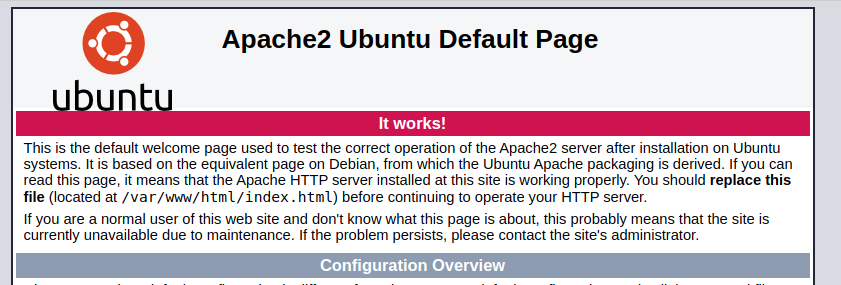

# Setup LAMP Stack

> Code တွေကို `copy/paste` မလုပ်ခင်် စာအရင်ဖတ်ပါ

- ဒီ artical ကိုတော့ digitalocean ရဲ့ [community tutorial](https://www.digitalocean.com/community/tutorials/how-to-install-linux-apache-mysql-php-lamp-stack-on-ubuntu-20-04) ကတော့ reference ယူထားပါတယ်။

</br>

## Menu

- [x] [Introduction](#introduction)
- [x] [Installing Apache and Updating the Firewall](#installing-apache-and-updating-the-firewall)
- [x] [Installing MySQL](#installing-mysql)
- [x] [Installing PHP](#installing-php)
- [x] [Configuration](#configuration)
  - [x] [Enable prefork module and disable event module in Apache](#enable-prefork-module-and-disable-event-module-in-apache)
  - [x] [Create virtual Host and change Apache default root path](#create-virtual-host-and-change-apache-default-root-path)
  - [x] [Adding more hosts name](#adding-more-hosts-name)

---

</br>

## Introduction

**LAMP** stand for -

- L => Linux operating system
- A => Apache web server
- M => MySQL database
- P => PHP

</br>

## Installing Apache and Updating the Firewall

- Web server တွေထဲမှာမှ Apache ဟာ လူသုံးအများဆုံး server တစ်ခုဖြစ်ပါတယ်။ အကြောင်းကတော့ local မှာရော production မှာပါ stable ဖြစ်တဲ့အတွက်ကြောင့်ပါ။

</br>

```bash
# Updating the package manager cache
sudo apt update

# Install Apache
sudo apt install -y apache2

# To only allow traffic on port 80
sudo ufw allow in "Apache"

# To only allow traffic on port 443
sudo ufw allow in "Apache Full"
```

</br>

- Browser ကနေ address bar မှာ `localhost` ရိုက်ကြည့်ပါ။ အောက်ပါပုံအတိုင်း ပေါ်လာရင်တော့ မိမိစက်မှာ apache web server က အဆင်ပြေပြေအောင်အောင်မြင်မြင် run နေပါပြီ။

</br>



</br>

## Installing MySQL

- Node js မှာတုန်းက NoSQL database ဖြစ်တဲ့ MongoDB database ကို install တင်ခဲ့သလိုပဲ php မှ အသုံးများတဲ့ SQL database ဖြစ်တဲ့ MySQL databse ကို install တင်ပါမယ်။ နောက်ပိုင်း php ပဲဖြစ်ဖြစ် nodejs မှာပဲဖြစ်ဖြစ် ကြိုက်တဲ့ database နဲ့ တွဲသုံးလို့ရတာပေါ့

</br>

```bash
# Install mysql server
sudo apt install -y mysql-server
```

</br>

- MySQL ကိုတော့ install လုပ်ပေးပြီပါပြီ။ နောက်တစ်ဆင့်အနေနဲ့ secure script ကို run ပေးဖို့လိုပါတယ်။
- ဒီနေရာမှာ သတိပြုရမှာကတော့ `mysql_secure_installation` ပြုလုပ်တဲ့အခါ **VALIDATE PASSWORD PLUGIN** ကို အသုံးပြုမလားလို့ မေးပါလိမ့်မယ်။ အသုံးပြုမယ်ဆို **`Y`** (Yes) ထည့်ပေးပြီး မသုံးဘူးဆို **`N`** (No) ထည့်ပါ။
- VALIDATE PASSWORD PLUGIN ဆိုတာက MySQL ကိုအသုံးပြုတဲ့ user ရဲ့ password ကို strong ဖြစ်မဖြစ်စစ်ပေးတဲ့ကောင်မျိုးပါ။
- ဥပမာ VALIDATE PASSWORD PLUGIN ကို yes ပေးထားရင် Root user မှာ password ကို root ပြန်ပေးတာမျိုးလုပ်လို့မရပါဘူး။ အနဲ့ဆုံး 1digit, 1uppercase, 1lowercase and 1symbols ဖြစ်ရမယ် စသည်ဖြင့် သတ်မှတ်ထားတာမျိုး strong ဖြစ်တဲ့ password မျိုးဟုတ်မဟုတ်စစ်ပေးထားပါ
- ဒါကြောင့် ကျနော်ကတော့ local မှာ install တင်တာဖြစ်တဲ့အတွက် **`N`** (No) ကို ထည့်လိုက်ပါတယ်။ Production level မျိုးမှာဆိုရင်တော့ plugin ကိုအသုံးပြုသင့်ပါတယ်
- နောက်ထပ် မေးခွန်းတွေအားလုံးအတွက် **`Y`** (Yes) ကိုပဲထည့်ပေးပါ။

</br>

```bash
sudo mysql_secure_installation

# Hit n for first question and Hit y for other
```

</br>

- MySQL ကို insall တင်ပြီးပြီ secure script လဲ run ပြီးသွားပြီဆိုတော့ MySQL database ထဲကို ဘယ်လိုဝင်မလဲ။ MySQL မှာက MongoDB လိုမျိုး official ထောက်ပံပေးထားတဲ့ GUI (Graphical User Interface) application မရှိပါဘူး။
- MongoDB လိုမျိုး MongoDb Compass မရှိပေမဲ့ phpMyAdmin လို့ခေါ်တဲ့ third party web application ကိုအသုံးပြုပြီး GUI သဖွယ်ပြုပြင်တာမျိုးလုပ်လို့ရပါတယ်။
- MySQL ကို အသုံးပြုဖို့ official နည်းလမ်းကတော့ terminal ကနေပဲဖြစ်ပါတယ်။
- အောက်ဖော်ပြပါ code ကိုအသုံးပြုပြီး MySQL ကို အသုံးပြုနိုင်ပါတယ်။

</br>

```bash
# Open MySQL
sudo mysql
```

</br>

- Terminal မှာ မိမိစက်ရဲ့ u**ser_name@machine_name** ကနေ mysql> ဆိုပြီး ပြောင်းလဲသွားတာ တွေ့မိမယ်ထင်ပါတယ်။
- MySQL ကနေ ထွက်မယ်ဆိုရင်တော့

</br>

```bash
# Exit from MySQL
exit
```

</br>

> phpMyAdmin ကိုတော့ install ပြုလုပ်ပြီး အသုံးပြုပုံကို သီးသန့် နောက်အခန်းမှာ တင်ပေးမှာဖြစ်ပါတယ်။

</br>

## Installing PHP

- ဆက်လက်ပြီး PHP ကို Install ပြုလုပ်ပါမယ်။

</br>

```bash
# Install PHP
sudo apt install -y php libapache2-mod-php php-mysql

# check php version
php -v
```

- PHP version ဟာ 7.4.3 ဖြစ်နေတာတွေ့မှာပါ။ ကျန်တော်တို့က ပိုကောင်းတဲ့ PHP8 ကိုပြောင်းသုံးပါမယ်။

</br>

```bash
# Add the PHP Repository
sudo add-apt-repository ppa:ondrej/php

# Press Enter and add Apache Repository
sudo add-apt-repository ppa:ondrej/apache2

# Press Enter and update system
sudo apt update

# Upgrade system
sudo apt upgrade -y
```

- `apt upgrade` လုပ်ပြီးသွားရင်တော့ screen `clear` လုပ်ပြီး `php -v` ဆိုပြီး php version ကို check လုပ်ကြည့်ပါ။ version 8 ဖြစ်သွားတာကိုတွေ့ရမှာပါ။
- Optional အနေနဲ့ နောက်ထပ် package တစ်ချို့ ထပ်ထည့်ပါမယ်။

</br>

```bash
sudo apt install -y php-common php-cgi php-mbstring php-curl php-gd php-xml php-xmlrpc php-pear

sudo apt install php8.0-common php8.0-mysql php8.0-cgi php8.0-mbstring php8.0-curl php8.0-gd php8.0-xml php8.0-xmlrpc php-pear php8.0-fpm
```

</br>

> PHP8 ဟာ stable ဖြစ်ပေးမဲ့ ခုစာရေးချိန်မှာ lts (Long Time Support) version မဟုတ်သေးပါဘူး။

</br>

- PHP FastCGI Process Manager (FPM) package က web server ရဲ့ စွမ်းဆောင်ရည် မြင့်တင်ဖို့နဲ့ memory သုံးစွဲမှု လျှော့ချဖို့အတွက်ဖို့အတွက် စွမ်းဆောင်ပေးပါတယ်။
- Apache ရဲ့ module တစ်ခုဖြစ်တဲ့ FastCGI နဲ့ အတူ FPM တို့ကိုတွဲဖတ်အသုံးပြုရမှာဖြစ်ပါတယ်။

```bash
# Install the php-fpm package
sudo apt install -y php-fpm

# Install the associated Apache module.
sudo apt install -y libapache2-mod-fcgid

# Check the php8.0-fpm service is running
sudo systemctl status php8.0-fpm

# Press q to exit

# Enable the Apache modules required by FPM
sudo a2enmod actions fcgid alias proxy_fcgi

sudo a2enconf php8.0-fpm

# To activate the new configuration
systemctl restart apache2
```

</br>

## Configuration

- အသုံးပြုရာတာပိုမိုအဆင်ပြေစေဖို့နဲ့ performance ပိုကောင်းစေဖို့ configuration တစ်ချို့ပြုလုပ်ပါမယ်။

</br>

### Enable prefork module and disable event module in Apache

</br>

```bash
sudo nano /etc/apache2/mods-available/mpm_prefork.conf
```

- ထို့နောက် အောက်ဖော်ပြပါ နေရာတွေမှာ ပြင်ပါ။ ထို့နောက် file ကို save လုပ်ပါ။

```bash
<IfModule mpm_prefork_module>
  StartServers            4
  MinSpareServers         3
  MaxSpareServers         40
  MaxRequestWorkers       200
  MaxConnectionsPerChild  10000
</IfModule>
```

- ပြီးရင်တော့ event module ကို disable လုပ်ပြီး prefork module ကို enable လုပ်ရပါမယ်။

```bash
# Disable event module
sudo a2dismod mpm_event

# Enable prefork modle
sudo a2enmod mpm_prefork

# Restart Apache
sudo systemctl restart apache2
```

</br>

### Create virtual Host and change Apache default root path

- Apache ရဲ့ default document root path က `/var/www/html` ဖြစ်ပါတယ်။ /var/www အစား desktop ပေါ်မျာ www folder တည်ဆောက်ပြီး defualt root ပြောင်းပါမယ်။ ဒါဆို `localhost` ဟာ /home/user/Desktop/www ထဲက file တွေ folder တွေကို ဖော်ပြပေးသွားမှာဖြစ်ပါတယ်။
- မိမိpc ရဲ့ username ကိုသိဖို့လို့ပါတယ်။ မသိရင် terminal ကနေ `whoami` ဆိုပြီးရိုက်ကြည့်နိုင်သလို။ File mananger ကနေတဆင့် other locations => computer => home ထဲမှာလဲ မိမိ username နဲ့ folder ကို ကြည့်ရှုစစ်ဆေးနိုင်ပါတယ်။

</br>

> ကျန်တော့ရဲ့ username က killer လို့ပေးထားတာဖြစ်တဲ့အတွက် home/killer/ ဆိုပြီး တွေ့ရမှာဖြစ်ပါတယ်။ မိတ်ဆွေတို့တော့ killer နေရာမှာ မိမိ pc username ကိုပြောင်းထည့်ပြီးမှ code ကို run ပါ။

</br>

#### 1. Create Vitrual Host config file

- First setp အနေနဲ့ www.conf ဆိုတဲ့ config file လေးတစ်ခုကို /etc/apache2/sites-available/ ထဲမှာ တည့်ဆောက်ပါမယ်။
- အလွယ်ဆုံးနဲ့ ပုဂံလုံးစီးတဲ့အနေနဲ့ sites-available ထဲမှာ ရှိတဲ့ 000-default.conf ဆိုတဲ့ default configuration file ကိုပဲ copy ပွားလိုက်ပါမယ်။

</br>

```bash
# Copy 000-default.conf to www.conf
sudo cp /etc/apache2/sites-available/000-default.conf /etc/apache2/sites-available/www.conf
```

</br>

#### 2. Edit on www.conf file

- Copy ကူးထားတဲ့ www.conf file ကိုဖွင့်ပြီး လိုတိုးပိုလျော့လေးလုပ်ရအောင်ပါ။

</br>

```bash
# Open www.conf with nano
sudo nano /etc/apache2/sites-available/www.conf
```

</br>

- အောက်ပါအတိုင်း မပါတာထပ်ထည့်ပြီး ပြောင်းသင့်တာပြောင်းပါ။
- ထို့နောက် file ကို save ပါ။

</br>

```apache
# <Directory> ... </Directory> က အသစ်ထပ်ထည့်ရမှာပါ။
# killer ဆိုတဲ့နေရာမှာ မိမိတို့ရဲ့ username ပြောင်းလဲရန်သတိပြုပါ။
<Directory /home/killer/Desktop/www>
  Require all granted
</Directory>

# killer ဆိုတဲ့နေရာမှာ မိမိတို့ရဲ့ username ပြောင်းလဲရန်သတိပြုပါ။
<VirtualHost *:80>
  ServerAdmin webmaster@localhost
  DocumentRoot /home/killer/Desktop/www
  ErrorLog /home/killer/Desktop/www/logs/error.log
  CustomLog /home/killer/Desktop/www/logs/access.log combined
</VirtualHost>
```

</br>

#### 3. Edit on apache.conf

- /etc/apache2/apache2.conf ထဲမှာလဲ ထပ်ပြင်ပါမယ်။

</br>

```bash
sudo nano /home/killer/Desktop/www
```

</br>

- `<Direcotry /var/www/> ... </Direcotry>` ရဲ့အောက်မှာ အောက်ပါအတိုင်းထည့်ပါ။
- ထို့နောက် file ကို save ပါ။

```apache
# killer ဆိုတဲ့နေရာမှာ မိမိတို့ရဲ့ username ပြောင်းလဲရန်သတိပြုပါ။
<Directory /home/killer/Desktop/www>
  Options Indexes FollowSymLinks
  AllowOverride None
  Require all granted
</Directory>
```

#### 4. Create www folder on Desktop

- PHP file တွေရေးဖို့အတွက် Desktop ပေါ်မှာ www ဆိုတဲ့ folder တစ်ခုဖန်တီးပါမယ်။
- ထို့ပြင် log အတွက်လဲ logs ဆိုတဲ့ folder ကိုလဲ တည်ဆောက်ပါမယ်။
- www.conf ထဲမှာ DocuemntRoot မှာ Desktop/www ဆိုပြီး ချိတ်ဆက်ခဲ့ပြီးဖြစ်ပါတယ်။

</br>

```bash
mkdir ~/Deskotp/www/

mkdir ~/Desktop/www/logs
```

</br>

#### 5. Assign ownership of www directory to the user www-data

```bash
sudo chown -R www-data:www-data /home/killer/Desktop/www
```

</br>

#### 6. Set the permissions for the www directory

- File permission ကို local ဖြစ်လို့ 777 (full permission) ပေးပါမယ်။
- Production level မှာဆိုရင်တော့ 777 ဆို 100% hack ခံရမှာပါ :3။ 755 or တစ်ခြား permission ပေးသင့်ပါတယ်။

</br>

```bash
sudo chmod -R 755 ~/Desktop/www
```

</br>

#### 7. Create testing php file

- www folder ထဲမှာ localhost မှာ ကျန်တော်တို့ အသစ်ထည့်သွင်းထားတဲ့ root path အောင်မြင်လားစမ်းသပ်ကြည့်ဖို့ php file တစ်ခုတည်ဆောက်ပါမယ်။

</br>

```nano
echo "<?php \n phpinfo(); " > ~/Desktop/www/index.php
```

</br>

#### 8. Link virtual host file

- www folder ထဲမှာ index.php ထည့်ပေးရုံနဲ့ brower မှာ localhost တန်းရိုက်ထည့်လို့မရသေးပါဘူး။ ကျန်တော်တို့ တည်ဆောက်ထားတဲ့ www.conf ဆိုတဲ့ virtaul host file ကို link မချိတ်ရသေးပါဘူး
- ဒါကြောင့် 000-default.conf ကိုဖြုတ်ပြီး www.conf ကို ချိတ်ဆက်ပါမယ်။

</br>

```bash
# Link www.conf
sudo a2ensite www.conf

# Unlink 000-default.conf
sudo a2dissite 000-default.conf

# Reload Apache
sudo systemctl reload apache2
```

<br>

- Browser ရဲ့ address bar မှာ localhost ကိုရိုက်ကြည့်ပါ။ php information တွေပြတယ်ဆိုရင် အောင်မြင်ပါပြီ။

</br>


</br>

### Adding more hosts name

- localhost ဆိုတဲ့နေရာလေးမှာ မိမိနှစ်သက်တဲ့ name လေးတွေချိန်းရအောင်။ ဥပမာ- localhost အစား minkgkyaw.com.mm လို့ရိုက်လိုက်တာနဲ့ localhost ထဲရောက်သွားတာမျိုးပေါ့။ node js နဲ့ port 3000 မှာ run နေရင် localhost:3000 အပြင် mkk.local:3000 ဆိုပြီး run ရတာမျိုး။ localhost မှာ မိမိစိတ်ကြိုက်ပေးထားတဲ့ example နဲ့ run ကျမယ်။ 🤤️🤤️🤤️

</br>

```bash
sudo nano /etc/hosts
```

</br>

- 127.0.0.1 localhost ရဲ့အောက်မှာ မိမိအဆင်ပြေသလို ထပ်ပေးလို့ရပါတယ်။ ဥပမာ -

```bash
# 127.0.0.1     မိမိပေးခြင်သော name
127.0.0.1       mkk.com.mm
127.0.0.1       killer.com
127.0.0.1       minkgkyaw.com.mm
127.0.0.1       mkk.local
```

</br>


</br>

- Broswer မှာ မိမိပေးထားတဲ့ name နဲ့စမ်းကြည့်ပါ။ connection not secure ပြရင် continue to site လုပ်လိုက်ပါ။ အဆင်ပြေသွားပါလိမ့်မယ်။

---

</br>

### [Back to Menu](#menu)

### [Previous Page](/8.Code_env.md#setting-up-for-coding-environment)

### [Next Page](/9.Setup_LAMP.md#setup-lamp-stack)
